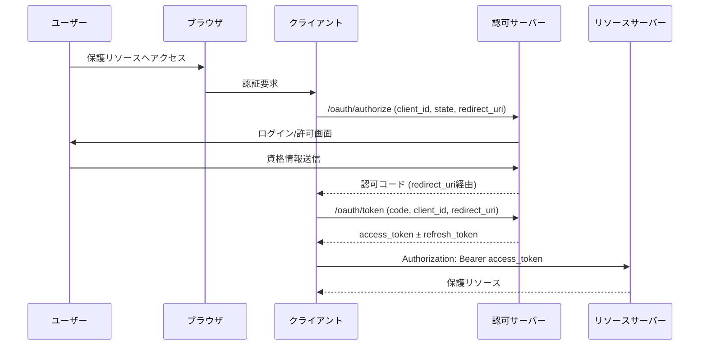
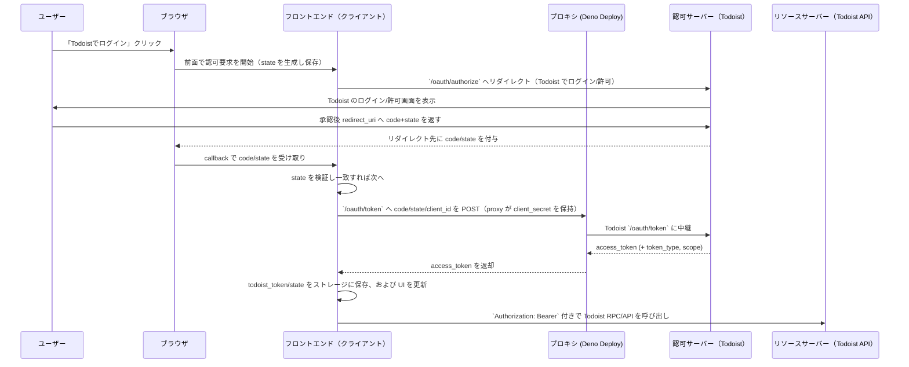

# フロントエンド認証設計：OAuth コードフロー（プロキシ経由）

## 背景と目的
- Todoist OAuth のクライアントシークレットをフロントに露出させないため、プロキシ経由の OAuth コードフローを採用する。
- クライアントシークレットはフロントに置かず、Deno Deploy 上の `proxy/main.ts` に集約。
- 既存の Effect ベースのサービス層を温存しつつ、認証は公式 SDK で state 生成を行う。

## フロー概要
1. 「Todoistでログイン」クリックで `getAuthStateParameter()` で生成した state を localStorage / sessionStorage に保存し、`https://todoist.com/oauth/authorize` へリダイレクト（scope は `VITE_TODOIST_PERMISSIONS`）。
2. Todoist から `redirect_uri`（例: `/callback`）へ `code` と `state` が返る。
3. フロントは state を検証した上で、プロキシの `/oauth/token` に `client_id`/`code`/`redirect_uri` を POST。返却された `access_token` を `todoist_token` として保存。
4. 認証済み表示時はヘッダーにトークン末尾のみを表示し、`/oauth/revoke` を叩いてログアウト（失敗時もローカルのトークンは必ず削除）。
5. デバッグ用にアクセストークン手動入力フォームを非デフォルトのフォールバックとして保持。

## OAuth フロー図
以下では一般的な OAuth 2.0 の認可コードフローと、当プロジェクトの Todoist 連携で実際に動いているコンポーネント構成を Mermaid で可視化しています。目的は認証処理の責務と通信経路を整理することです。

### 一般的な OAuth 2.0 認可コードフロー

この図は「ユーザーの意思でログイン・許可」「クライアントがコードをサーバーに交換」「取得したトークンでリソースにアクセス」という責務を順に追っています。state パラメーターは CSRF 防止、access/refresh token は再利用と更新に用いられます。

### Todoist API 連携フロー（用語の対応）

この図では「フロントエンド = クライアント」と「プロキシ = client_secret を保持するサーバー」を明確に分離しています。Todoist `/oauth/token` へのトークン交換はプロキシが代行し、フロントエンドは state/トークンの検証・保存とリソースアクセスだけを担うことで、認証情報の漏洩を防ぎながら一般的な認可コードフローと用語を揃えています。必要に応じて `/oauth/revoke` へリクエストし、ストレージのトークンをクリアすることで安全にログアウトできます。

## ストレージキー
- `todoist_token`: アクセストークン
- `oauth_state`: CSRF 対策用 state（localStorage / sessionStorage 両方）

## API 経路
- `VITE_PROXY_URL/rpc`: `@effect/rpc` を経由して `ExchangeOAuthToken` / `RevokeOAuthToken` を呼び出す。NDJSON プロトコルで型の一致を担保する。
- Todoist API 本体:
  - REST v2 系エンドポイント（例: `GET https://api.todoist.com/rest/v2/tasks`）はブラウザから直接呼び出す。
  - 完了済みタスク統計は `GET https://api.todoist.com/api/v1/tasks/completed/by_completion_date` をブラウザから直接呼び出す（CORS 対応済み）。
